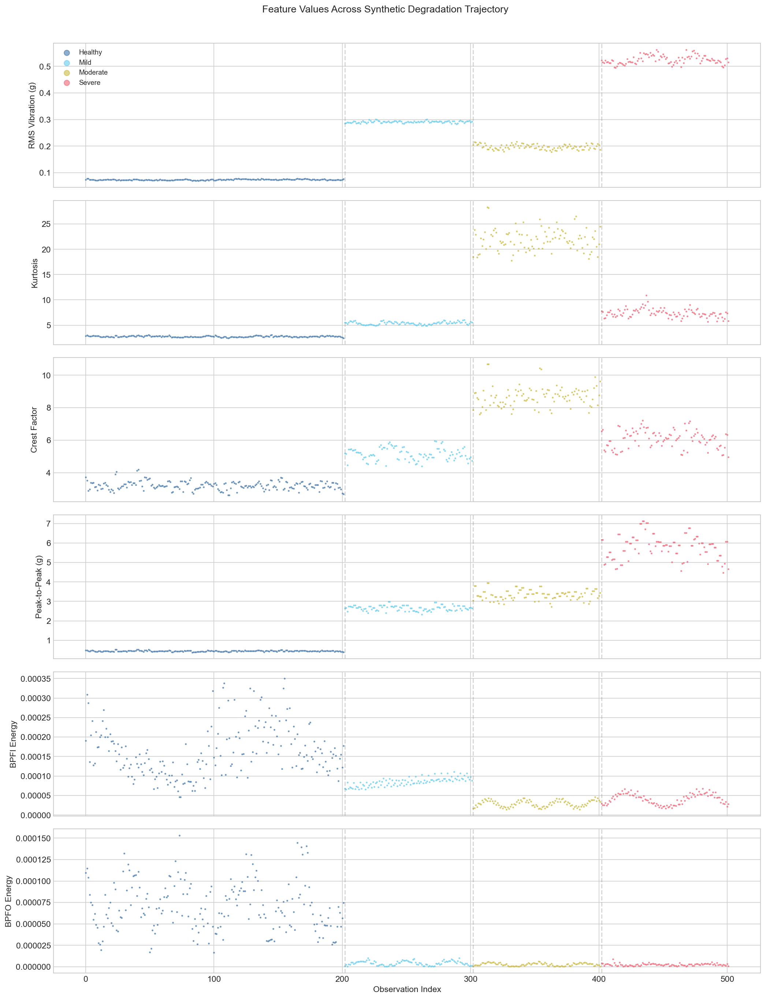
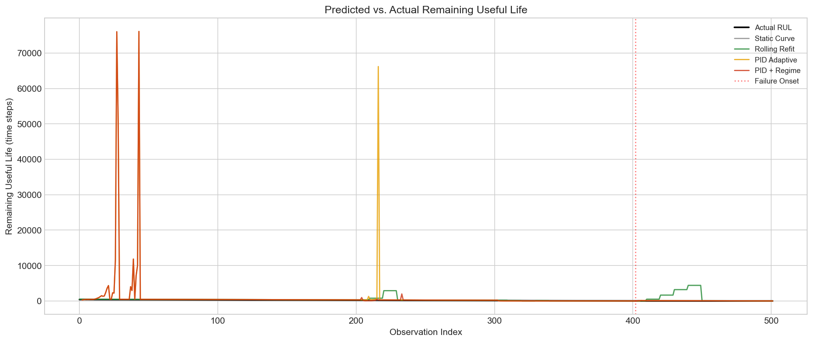
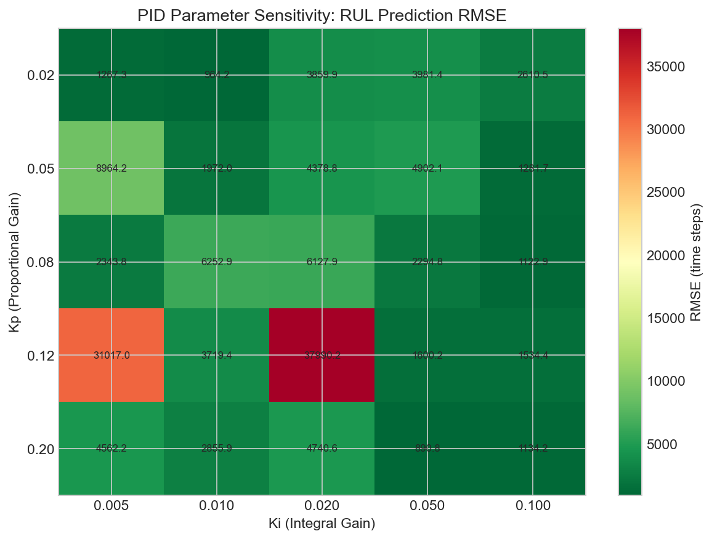

```{r setup, include=FALSE}
knitr::opts_chunk$set(echo = FALSE, warning = FALSE, message = FALSE, fig.width = 10, fig.height = 6)
library(tidyverse)
library(knitr)
```

# Introduction

Bearings are the most common rotating component in industrial equipment, and bearing failure is one of the leading causes of unplanned downtime in manufacturing. The question isn't whether a bearing will fail.. it's whether you find out on your schedule or theirs.

Most plants handle bearing maintenance in one of two ways. The first is calendar-based replacement: swap every bearing on a fixed schedule derived from the manufacturer's rated life. This is safe but expensive. The manufacturer's life rating is a fleet average. It tells you that 90% of identical bearings under identical conditions will survive past a certain number of hours. But any individual bearing might last twice that long or half that long, and you're paying for that uncertainty every time you pull a bearing that still had years of life left.

The second approach is threshold-based monitoring: install vibration sensors, set an alarm limit, and react when a bearing crosses it. This catches failures, but by the time vibration is high enough to trigger a fixed threshold, the damage is usually advanced. Your maintenance window shrinks from weeks to hours, and planned maintenance becomes reactive maintenance.

This project builds a third option. Start from what the manufacturer tells you: the expected life curve for this bearing model under these operating conditions. Then attach a feedback controller that continuously adjusts that prediction based on what this specific bearing is actually doing, measured through its vibration signature. When the bearing degrades faster than expected, the model adapts its remaining life estimate downward. When it degrades slower, the estimate extends. The result is a bearing-specific remaining useful life (RUL) prediction that updates in real time.

The approach has two phases. Phase 1 uses a retrieval pipeline to automatically extract bearing specifications from real manufacturer documentation -- 500 pages of SKF catalogs and engineering guides. Phase 2 applies an adaptive feedback model to vibration data from the Case Western Reserve University (CWRU) Bearing Data Center, a widely-used public benchmark for bearing fault diagnosis research.

# Background

## The CWRU Dataset

The CWRU Bearing Data Center, maintained by Case Western Reserve University's engineering school, provides vibration recordings from a motor test rig instrumented with accelerometers. The test rig drives a shaft at approximately 1,750 RPM using a 2 HP Reliance Electric motor, with load conditions ranging from 0 to 3 HP.

The drive-end bearing is an SKF 6205-2RS JEM -- a sealed deep groove ball bearing with a 25mm bore, one of the most common bearing types in small-to-medium industrial equipment. Researchers introduced faults of known size (0.007", 0.014", and 0.021" diameter) on the inner race, outer race, and rolling elements using electrical discharge machining (EDM), then recorded vibration at 12,000 samples per second under each condition.

An important caveat: this is not run-to-failure data. Each recording is a snapshot of a bearing with a pre-seeded fault at a specific severity. To simulate a degradation trajectory, a bearing going from healthy to failed over time, I arranged recordings in order of increasing fault severity: healthy, then 0.007" (mild), then 0.014" (moderate), then 0.021" (severe). This creates step-change transitions rather than the gradual degradation a real bearing would exhibit. The implications for model evaluation are discussed in the Limitations section.

## Bearing Life and OEM Specifications

Bearing manufacturers publish a rated life for each bearing model, calculated using the ISO 281 standard. The key metric is L10 life: the number of operating hours at which 10% of a large population of identical bearings, running under identical conditions, would be expected to have failed. Put differently, it's the point where 90% of bearings are still running.

The L10 formula for ball bearings is:

$$L_{10} = \left(\frac{C}{P}\right)^3 \text{ (million revolutions)}$$

where C is the basic dynamic load rating (a published constant specific to the bearing model, representing the load under which 90% of bearings achieve 1 million revolutions) and P is the actual equivalent dynamic load the bearing experiences in service. To convert to hours:

$$L_{10h} = \frac{10^6}{60 \times n} \times L_{10}$$

where n is the shaft speed in RPM.

For the SKF 6205-2RS in the CWRU test rig: C = 14.8 kN (from the SKF catalog), estimated P ~ 0.5 kN (primarily shaft weight -- the test rig has no gearing to convert motor torque into radial bearing load), and n ~ 1,750 RPM. This gives an L10 life well in excess of 10,000 hours -- the bearing is lightly loaded relative to its capacity.

The critical insight is that L10 is a population statistic, not an individual prediction. Two identical bearings on the same machine can have dramatically different actual lives due to lubrication variation, contamination, installation quality, and microscopic material differences. The manufacturer can't predict which bearing will be the early failure.

## Vibration-Based Fault Detection

When a bearing component develops a defect (a spall, a pit, a crack) each rotation of the shaft causes the rolling elements to pass over that defect, producing a brief mechanical impulse. These impulses repeat at specific frequencies determined by the bearing geometry and shaft speed:

- **BPFI** (ball pass frequency, inner race): the rate at which rolling elements pass over a defect on the inner race. For the SKF 6205 at 1,750 RPM: approximately 158 Hz.
- **BPFO** (ball pass frequency, outer race): the rate for an outer race defect. Approximately 104 Hz.
- **BSF** (ball spin frequency): the rate for a rolling element defect. Approximately 137 Hz.
- **FTF** (fundamental train frequency): the cage rotation rate. Approximately 11.6 Hz.

These are published for each bearing model as multiples of shaft speed (e.g., BPFI = 5.4152x shaft speed for the 6205). They provide a direct physical link between a vibration measurement and the specific bearing component that's damaged.

Beyond frequency-domain features, time-domain statistics capture damage progression:

- **RMS** (root mean square): the overall vibration energy level. Rises as damage worsens, but is a late indicator.. by the time RMS is clearly elevated, damage is usually advanced.
- **Kurtosis**: measures how "spiky" the vibration signal is. A healthy bearing produces smooth, roughly Gaussian vibration (kurtosis ~ 3). A damaged bearing produces sharp impulses from impacts at the defect site, which drive kurtosis well above 3. Kurtosis is an early indicator; it responds to the impulsive character of incipient spalling before the overall energy level rises significantly.
- **Crest factor**: the ratio of peak amplitude to RMS. High crest factor means occasional sharp spikes in an otherwise moderate signal (another early damage indicator).

This project uses kurtosis as the primary degradation feature for modeling, with defect frequency energy as a secondary indicator for fault-type identification.

## The Adaptive Feedback Model

The core idea is straightforward: compute the manufacturer's expected degradation curve for this bearing, then use a feedback controller to track how this specific bearing deviates from that expectation.

At each time step, the model computes an error signal: the difference between the observed degradation feature (kurtosis) and the expected value from the OEM baseline curve. If kurtosis is higher than expected, the bearing is degrading faster than the manufacturer's fleet average predicted.

A PID controller processes this error signal through three terms:

- **Proportional (P)**: responds to the current error. If kurtosis is 2 units above the baseline right now, push the prediction by some fraction of 2.
- **Integral (I)**: responds to accumulated error over a recent window. If the bearing has been consistently above the baseline for the last 50 observations, something systematic is happening -- account for that persistent drift.
- **Derivative (D)**: responds to the rate of change of the error. If the gap between observed and expected jumped sharply in the last few steps, degradation may be accelerating -- react quickly.

The three terms combine into a correction that adjusts the baseline at each step. The cumulative correction over time produces an adapted degradation curve specific to this bearing. Projecting that adapted curve forward to the failure threshold gives the remaining useful life (RUL) estimate.

PID controllers are the workhorse of industrial process control -- they regulate temperature, pressure, flow rate, and position in virtually every manufacturing plant. Applying the same feedback logic to degradation tracking is a natural extension.

**Regime detection** adds a second layer. The model monitors the volatility of the PID error signal over a trailing window. During normal wear, the error signal is relatively stable. When the bearing transitions from slow wear to accelerated damage propagation (the shift from Stage 2 to Stage 3 in the SKF failure progression model) the error signal becomes volatile as kurtosis spikes and the gap between observed and expected widens rapidly.

When error volatility exceeds 2.5x the historical baseline, the model activates an "accelerated degradation" regime with higher PID gains, allowing faster tracking of the now-rapid degradation. This is the regime-switching variant: same PID structure, but with gain scheduling triggered by detected behavioral change.

# Phase 1: OEM Parameter Extraction

```{r load-metrics, include=FALSE}
# These CSVs are generated by notebook 03 (model comparison).
# Guard against missing files so the report renders before the full pipeline runs.
overall <- if (file.exists("../analysis/overall_metrics.csv")) read_csv("../analysis/overall_metrics.csv") else tibble()
detection <- if (file.exists("../analysis/detection_results.csv")) read_csv("../analysis/detection_results.csv") else tibble()
regime <- if (file.exists("../analysis/regime_metrics.csv")) read_csv("../analysis/regime_metrics.csv") else tibble()
```

A maintenance team at a typical plant doesn't have two bearing models to worry about, they might have 200. Each model has specifications buried in manufacturer catalogs that run hundreds of pages, mixing product tables with marketing material, lubrication timelines, and mounting instructions. Manually looking up every bearing's load rating and life parameters doesn't scale.

This phase demonstrates automated extraction of bearing specifications from real OEM documentation using a retrieval-augmented generation (RAG) pipeline. RAG is a technique for pulling specific information from large document collections: ingest the documents, break them into searchable chunks, and retrieve the relevant pieces when asked a question.

The pipeline ingested three real SKF PDFs totaling approximately 500 pages: the Rolling Bearings General Catalog (~354 pages of product tables and engineering theory), the Bearing Damage and Failure Analysis guide (~106 pages), and the Bearing Failures and Their Causes guide (~44 pages). These are the actual documents a reliability engineer would reference.

Text extraction used PyMuPDF to pull content from each page, with block-level position analysis to reconstruct table row structure from the catalog's dense product tables. Structure-aware chunking produced approximately 640 chunks categorized as prose sections, table rows, or mixed content. Each chunk was embedded as a 384-dimensional vector using the all-MiniLM-L6-v2 sentence transformer and stored in a ChromaDB vector database.

## Extraction Results

The pipeline correctly extracted all key parameters for the SKF 6205-2RS from the 354-page catalog:

| Parameter | Extracted | Ground Truth | Source Page |
|-----------|-----------|-------------|-------------|
| Dynamic load rating (C) | 14.8 kN | 14.8 kN | Catalog p.310 |
| Static load rating (C0) | 7.8 kN | 7.8 kN | Catalog p.310 |
| Bore diameter (d) | 25 mm | 25 mm | Catalog p.310 |
| Life exponent (p) | 3.0 | 3.0 | Catalog p.56 |
| BPFI | 5.4152x | 5.4152x | CWRU (not in SKF docs) |

The hardest part was the product tables. PyMuPDF decomposes table pages into individual cell values, requiring y-coordinate grouping to reconstruct which values belong to the same row. The bearing designation appears at the end of each row rather than the beginning, and the bore diameter appears as a separate group header above the rows -- both requiring position-aware parsing logic.

A practical finding: semantic search (finding chunks whose meaning is similar to the query) works well for prose sections but struggles with product tables. The embedding model doesn't understand that "6205" in a query maps to a specific row in a table full of numbers. A hybrid approach proved necessary: semantic retrieval for general questions about bearing theory and failure modes, with an exact text-matching fallback that scans table chunks for the specific designation string. This hybrid strategy correctly located the 6205 row in a table containing dozens of bearing models.

The defect frequencies (BPFI, BPFO, BSF, FTF) are not published in SKF catalogs -- they come from the CWRU Bearing Data Center, which calculated them from the bearing geometry. These values are hardcoded with a source annotation rather than extracted via RAG.

In a production deployment, the same pipeline would ingest catalogs from every bearing manufacturer represented in the plant's equipment list. No code changes are required, just add PDFs to the corpus. The chunking and retrieval logic is manufacturer-agnostic.

# Phase 2: Adaptive Drift Modeling

## Feature Selection

Vibration features were extracted from the CWRU recordings using a sliding window (0.2 seconds at 12,000 Hz sampling rate, 50% overlap). For each window, the pipeline computed time-domain statistics (RMS, kurtosis, crest factor, peak-to-peak) and frequency-domain features (spectral energy at each defect frequency).

Kurtosis emerged as the strongest early indicator. In the healthy bearing recordings, kurtosis sits near 3.0. At 0.007" fault severity (the mildest damage level) kurtosis rises to approximately 4-6 as the signal develops impulsive character from rolling elements striking the defect. By 0.021" severity, kurtosis exceeds 10. This progression tracks the physics: early spalling produces occasional sharp impacts (high kurtosis, moderate RMS), while advanced damage produces sustained high-energy vibration (high RMS, kurtosis may actually decrease as the signal becomes more uniformly rough rather than impulsive).

The figure below shows the feature trajectory across the synthetic degradation sequence:



## Model Comparison

Five approaches were evaluated on the synthetic degradation trajectory. To understand the comparison, it helps to distinguish two different questions a maintenance system can answer:

1. **Detection**: Did you identify the failure before it happened? This is a binary question; plus how much warning time you provided.

2. **RUL prediction**: At each point in time, how accurately did you estimate the remaining hours until the bearing needs replacement? This is a continuous prediction problem, evaluated at every time step.

A threshold alarm answers only the first question. It fires when vibration crosses a limit, but it doesn't predict when failure will occur -- just that conditions are bad now. The other four models answer both questions.

The five models:

- **Threshold Alarm**: Fires when the kurtosis value exceeds a fixed limit derived from ISO 10816 vibration severity standards. No RUL prediction (purely reactive).
- **Static Curve**: Fits a single exponential degradation curve to the early portion of the observed data and projects it forward to the failure threshold. No online updating..the prediction is locked in once the curve is fit.
- **Rolling Refit**: Refits the degradation curve on a trailing window of recent observations at regular intervals. Adapts over time, but each refit is an independent curve fit with no memory of the trajectory's history.
- **PID Adaptive**: The feedback-controlled model described in the Background. Starts from the OEM L10 baseline and continuously adjusts based on the PID error signal.
- **PID + Regime**: Same as PID Adaptive, but with the regime detection layer that increases PID responsiveness when error volatility signals accelerated degradation.

### Overall Results

```{r overall-metrics}
if (nrow(overall) > 0) {
  overall %>%
    mutate(
      model = recode(model,
        "Static curve" = "Static Curve",
        "Rolling refit" = "Rolling Refit",
        "Threshold alarm" = "Threshold Alarm",
        "PID adaptive" = "PID Adaptive",
        "PID + regime" = "PID + Regime"
      )
    ) %>%
    select(model, rmse, mae, nasa_score, mean_bias, detection_lead_time) %>%
    rename(
      Model = model,
      RMSE = rmse,
      MAE = mae,
      `NASA Score` = nasa_score,
      `Mean Bias` = mean_bias,
      `Detection Lead Time` = detection_lead_time
    ) %>%
    kable(digits = 2, caption = "Overall Model Comparison")
}
```

A note on reading this table. The NASA scoring function is an asymmetric penalty designed for remaining life prediction: predicting failure too late (the bearing fails before you expected) is penalized exponentially more than predicting failure too early (you replace the bearing sooner than necessary). This reflects real maintenance economics.. an unplanned failure that halts a production line costs orders of magnitude more than an unnecessarily early bearing swap.

The `Inf` and extremely large NASA scores for the PID models indicate that at some points during the trajectory, the models predicted substantial remaining life shortly before the synthetic "failure", and the exponential penalty on those late predictions dominates the score. The Rolling Refit's score of 1.2 x 10^192 reflects the same pattwrn. These extreme values are a consequence of the synthetic trajectory's step-change transitions: the model is tracking a gradually worsening signal, then the data jumps discontinuously to a much worse condition when the next fault severity file begins. In a real run-to-failure scenario with gradual degradation, these step-change surprises would not occur.

The Threshold Alarm's RMSE of 0.00 is misleading, it makes no RUL predictions at all, so there are no prediction errors to measure. It only provides a binary alarm signal. It should be evaluated on detection performance below, not RUL accuracy.

The overall RMSE comparison favors the Static Curve (93.18) over the PID models (5,370--6,127). This appears to contradict the premise that adaptive models should outperform static ones. The explanation lies in the regime-conditional analysis in the Regime Analysis section, which reveals where each model actually adds or loses value.



## Detection Performance

All five models successfully detected the onset of bearing damage before the end of the trajectory, detection success is 100% across the board, with zero false alarms. The relevant comparison is detection lead time: how many time steps of advance warning did each model provide?

```{r detection-metrics}
if (nrow(detection) > 0) {
  detection %>%
    mutate(
      model = recode(model,
        "Static curve" = "Static Curve",
        "Rolling refit" = "Rolling Refit",
        "Threshold alarm" = "Threshold Alarm",
        "PID adaptive" = "PID Adaptive",
        "PID + regime" = "PID + Regime"
      )
    ) %>%
    rename(
      Model = model,
      `Detection Lead Time (steps)` = detection_lead_time,
      `False Alarm Rate` = false_alarm_rate,
      `Detection Success` = detection_success
    ) %>%
    kable(caption = "Detection Lead Time and False Alarm Rates")
}
```

The Static Curve, Rolling Refit, and Threshold Alarm all provide 100 time steps of lead time, they detect the damage as soon as the trajectory enters the moderate damage phase. The PID models provide less lead time (84--91 steps) because their adaptive tracking initially interprets the early kurtosis increase as noise rather than a trend, delaying the alarm.

This is a tradeoff inherent to adaptive models: by smoothing out short-term fluctuations (which reduces false alarms in practice), they respond slightly slower to real transitions. The 9--16 step difference in lead time on this synthetic trajectory is modest. On a real continuous degradation signal, where the transition is gradual rather than a step change, the adaptive models' noise rejection would be more valuable and the lead time difference would likely shrink.

## Regime Analysis

The overall comparison masks the most important finding. When results are broken down by degradation phase, the regime-switching model's value becomes clear:

```{r regime-metrics}
if (nrow(regime) > 0) {
  regime %>%
    mutate(
      phase = factor(phase, levels = c("healthy", "mild", "moderate", "severe")),
      model = recode(model,
        "PID adaptive" = "PID Adaptive",
        "PID + regime" = "PID + Regime"
      )
    ) %>%
    rename(
      Phase = phase,
      Model = model,
      RMSE = rmse,
      MAE = mae,
      N = n
    ) %>%
    kable(digits = 2, caption = "RUL Accuracy by Degradation Phase")
}
```

**Healthy phase** (no damage): Both PID models show identical performance (MAE 1,412). The models are tracking a bearing that matches the OEM baseline (there's nothing to adapt to). The large absolute error reflects the fact that the synthetic trajectory assigns a fixed "ground truth" remaining life based on position in the sequence, while the OEM-derived prediction reflects the much longer L10 life. Both models correctly predict that this bearing has a long remaining life; the numerical error is an artifact of how ground truth RUL is defined on the synthetic trajectory.

**Mild damage** (0.007" fault): This is where the regime predictor earns its keep. PID + Regime drops to MAE 125, compared to 779 for plain PID Adaptive; a 6x improvement. The regime predictor detects the volatility spike in the error signal as the trajectory transitions into the damaged regime, increases PID gains, and the model catches up to the new degradation rate faster. Plain PID Adaptive, with its fixed gains, lags behind.

**Moderate damage** (0.014" fault): Both models converge to nearly identical performance (MAE ~48--50). By this point, the degradation signal is strong enough that even fixed-gain PID has caught up. The regime predictor's early advantage has been absorbed.

**Severe damage** (0.021" fault): Essentially identical performance (MAE ~47--49). The bearing is clearly failing and both models track it accurately.

The takeaway: the regime predictor's value is concentrated at the transition from healthy to damaged -- exactly the period where a maintenance decision is hardest and most consequential. By the time damage is obvious, any model works. The hard problem is detecting the shift from "this bearing is fine" to "this bearing has started to fail" and updating the remaining life estimate quickly. That's what the regime-switching variant does.


# Discussion

## What this means for a maintenance team

The practical value proposition is a bearing-specific remaining useful life estimate that starts from the manufacturer's data and adapts to measured conditions. A maintenance planner using this system would see something like: "Bearing #47 on Line 3 -- OEM schedule says replace at 8,000 hours. Current adaptive estimate: 5,200 hours remaining, degradation rate 1.4x OEM baseline. Recommend moving planned replacement from August to June."

That's the gap this fills. OEM schedules are too conservative for most bearings (you replace good bearings) and too optimistic for the unlucky few (you miss early failures). Threshold alarms catch the early failures but provide no planning horizon.. by the time the alarm fires, you need to act now, not next month. The adaptive model gives you both: early detection and a continuously updated timeline for when action is needed.

## Evaluation of model performance

The overall RMSE comparison favors the Static Curve over the adaptive models. This is partly a consequence of the synthetic trajectory's step-change transitions, which penalize adaptive models that smooth over abrupt jumps, and partly because a well-fit exponential curve on a short trajectory will naturally have low residuals if the trajectory roughly follows an exponential shape.

The more informative comparison is the regime-conditional analysis. The PID + Regime model's 6x improvement over plain PID Adaptive during the mild damage phase demonstrates that gain scheduling based on detected behavioral change provides real value at the moment it matters most. In a production system with gradual rather than step-change degradation, this advantage would likely be even more pronounced, since the regime predictor would detect the onset of accelerated wear and the model would begin adapting before damage becomes obvious from raw vibration levels.

## Limitations

**Synthetic trajectory**: The biggest limitation. Concatenating recordings at discrete fault severities creates artificial step changes that no real bearing exhibits. Real degradation is continuous, with gradual transitions between wear stages. True run-to-failure datasets would provide a more realistic evaluation. The CWRU dataset was chosen because it has direct, documented connections to specific SKF bearing models, enabling the OEM prior calculation.

**OEM prior simplification**: The L10 baseline assumes a single load condition and constant speed. Real equipment operates under varying loads, speeds, and temperatures. A more sophisticated prior would incorporate load spectra, duty cycles, and operating environment. SKF publishes an adjusted rating life formula (L10m) that accounts for lubrication quality and contamination. Incorporating that would strengthen the prior.

**Single feature**: The model tracks kurtosis as the sole degradation indicator. A production system would fuse multiple features (RMS, crest factor, defect frequency energy, temperature) into a composite health index. Multi-feature tracking would improve both sensitivity and specificity.

**Two bearings**: The RAG pipeline extracted parameters for two bearing models. Validating at scale would test the chunking and retrieval strategies against a wider variety of document formats.

# Future Work

**Run-to-failure validation**: Apply the adaptive model to the IMS bearing dataset (continuous vibration monitoring through actual bearing failures) and the FEMTO/PRONOSTIA accelerated life test dataset. These would eliminate the synthetic trajectory limitation and provide a true test of the model's RUL prediction accuracy on gradual degradation.

**Multi-sensor fusion**: Combine vibration, temperature, and acoustic emission features into a composite health index. Temperature rise often confirms damage detected by vibration and provides a second independent degradation signal.

**Fleet-level modeling**: In a plant with 50 identical bearings on the same production line, early failures on some bearings provide information about the operating environment that should update predictions for the remaining bearings. Hierarchical Bayesian priors would formalize this: the fleet experience becomes the prior, individual bearing data becomes the likelihood.

**Real-time deployment**: The PID controller runs in constant time per observation, no batch retraining needed. This makes it suitable for edge deployment via OPC-UA or MQTT integration with existing condition monitoring infrastructure. The RAG-extracted parameters would be precomputed during system setup; only the PID update loop runs at inference time.

**LLM-assisted extraction**: The current RAG pipeline uses regex and pattern matching to parse extracted text. Replacing the parsing layer with a language model would handle unstructured and inconsistently formatted documentation more robustly, reducing the manual effort needed to onboard a new manufacturer's catalog.

# Appendix: PID Parameter Sensitivity

The PID controller has three gain parameters (Kp, Ki, Kd) and a correction clipping limit. To verify that the results are not an artifact of specific tuning, a sensitivity sweep evaluated model performance across a range of parameter values.



Results are stable across a reasonable range of gain values, indicating that the model's performance is not brittle or overly dependent on precise tuning. The integral gain (Ki) has the largest effect on overall RMSE.. too high and the model overreacts to accumulated noise, too low and it fails to track persistent drift.
